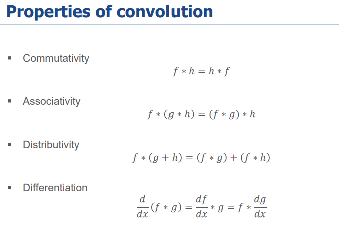

# Total

**Image Generation**

Convolution mask should be reversed before using

**Edge Detection**

**As long as the gradient direction are within the threshold, we are grouping them**

**Fourier Method**

**Sine components Fs(u) and Cosine components Fc(u)**

**Convolution operation in spatial domain becomes product operation in frequency domain**

**Rotation will only change phase, but not amplitude**

**In the middle is low frequency, on the edge is high frequency**

**Representation and Matching**
Cross correlation is comparing a template throughout the picture and check which area has the highest matching, before correlation, we should do preprocessing make sure both image and template has zero mean (shown in third equation)

Cross correlation and convolution: In cross correlation, the kernel is unflipped, in convolution, the kernel is flipped.

**For Template matching the complex conjugate of the FT is used, which is different from convolution**

Shape Discriminants: Shape discriminants are simple object property that can be computed from the image and are independent of the object position
Area: Counting pixel vs Area under edge vector

Area ⇒ The rectangle around it, Thickness ⇒ The maximum Number of Slice * 2

Moments
m00 ⇒ Total number of pixels, the area
m10 and m01 ⇒ Used to calculate the center of the rectangle
m20 and m02 ⇒ Measure spread on an axis

**Direction of a shape can be calculated by**

**How pk is calculated**

**Interesting Point Detection**
Desired property of Features

Why use corners:
For uniform regions, any changes will result in minimum changes.
For edges, moving along the edge will result in minimum changes.
For corners, any movement will result in significant changes.
Harris ⇒ Detecting changes on the x and y axes

Direction of Harris

Two eigenvectors will always be perpendicular.

When the corner is rotated, the eigenvalues will not change, but the eigenvectors will change.

LOG is expensive to calculate; we can use DoG to approximate it.

**Feature Descriptors and Matching**
Matching Feature in different images

Desired property of Feature Descriptor

Feature Matching
1. Directly compare distance with a threshold
2. Match the nearest keypoint in the feature space
3. Using the nearest Neighbour Distance Ratio, compare the distance between the nearest neighbour and second nearest neighbour. If the ratio is around 1, reject; if it is approximately 0, then accept.

**Feature Tracking**

Lucas Kanade assumes brightness constancy and temporal persistency.

For larger displacement, we can use multi-resolution on an image.

Kalman Filter: A method to estimate movement in the system and correct with actual measurement.

**Added non-linear extension to Kalman filters**

The reflected light intensity is constant for all directions for Lambertian Surface, and intensity is proportional to the cosine of the angle between the surface normal n.

**Camera Geometry**

F is the focal length, which is the distance between the center of projection to the image plane.

K is the intrinsic matrix, the former model is the projection matrix, mapping 2D points to 3D.

R is the rotation matrix, and t represents the displacement from the camera center to the new center.

The green one represents the relation between camera coordinates and image pixel coordinates (intrinsic matrix) (3D to 2D), the pink one represents the relation between world coordinates and camera coordinates (extrinsic matrix). The blue one combines the two, which is the projection matrix, projecting world coordinates to image coordinates.

**Geometric properties in 3D and 2D after projection in perspective projection**

**Geometric property in orthographic projection**

Camera distortion is put as a parameter in Intrinsic parameters.

**Computational Stereo**

Product of two points is a line, product of two lines is their intersection. X(λ) is the 3D point projected from 2D image plane.

All coordinates are normalized (By times K^-1), then we can simplify the foundational matrix to the essential matrix.

This is a special case where two cameras have the same camera parameters and are horizontal with the same orientation, making R identity.

The foundational matrix can also be estimated by solving the constraints by collecting a number of potential matches.

**Rectification** makes the two image planes on the same greater plane, making all epipolar lines horizontal, which makes the computation to find matches easier.

**Photometric Stereo**

Lambertian surface is the reflected light from all angles are all constant, and it is proportional to the cosine of the incidence angle.

We take derivatives of the surface with respect to X and Y; the two vectors are shown in green.
For Photometric Stereo, we have Orthogonal Projection.

The above equations are non-linear. A unique solution can be obtained if the equations are linear and independent, and we know the albedo.

Three different light conditions can help us estimate the p and q for every point in the image.

After getting P and Q, integration will give us the depth information of the point. However, this is inefficient as we have to do it for every point.

**Limitation of Shape from Shade method:**

**Optical Flow**

Use the assumption where nearby points have the same motion (same u and v).

u and v are 2D velocities of the object, which are also the only two unknowns.

As we have the assumption that nearby pixels have the same velocity, thus the same u and v.
Then use the least square method, similar to Lucas-Kanade, to solve it and get u and v.

How to use depth information of one point to estimate the other.

**Object Recognition**

Normalizing the patch can make it geometrically consistent, robust, and effective for matching.

Each descriptor is a point in space; we then use K-means to group them, making them a “word.” Then we can plot a histogram for each image for their “bag of words.”

Different Models to classify histogram:
- Nearest neighbour
- K-Nearest Neighbours
- SVM (Linear, Non-linear, and multiclass ones)

**Texture and Region-based Segmentation**

Histogram methods are vulnerable to noise and lighting effects.

Check for uniform criteria and stop after no block satisfies the uniform criteria are found.

Split the region into two if the criteria are satisfied.

P01, 0 describes the direction, and 1 describes the distance. The 0,0 entry should be 4 as there are 4 pairs of 0,0 with the direction and have a distance of 1.

The co-occurrence matrix should be normalized so each entry becomes the probability of co-occurrence. Therefore, it is independent of the window size.

